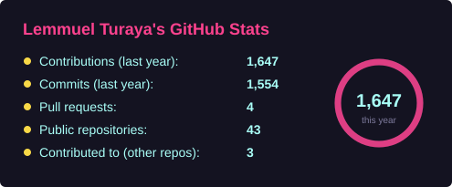
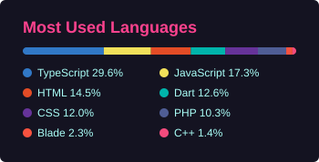

<div align="center">

# Hey, I'm Lemmuel Turaya 👋

### Full-Stack & Mobile Developer | Building Systems That Move Things

[](https://kon2raya.netlify.app)
[](https://kon2raya.netlify.app/night-shift.html)
[](https://www.linkedin.com/in/lemmuel-turaya)
[](mailto:turayalemmuel@gmail.com)

<br/>

*I design, build, and ship full-stack systems, from warehouse management to transport dispatch to autonomous AI agents. 6+ years in production, 9 written-up case studies, and an open-source toolkit for Filipino developers on npm and Packagist.*

</div>

---

## 🇵🇭 PH Dev Utils: open source for Filipino developers

Twelve focused libraries that encode Philippine rules (pesos, government IDs, PSGC addresses, payroll, BIR tax) with **the same behavior in JavaScript/TypeScript and PHP**, so a Laravel backend and a Vue or React frontend agree by construction. Published as `@ph-dev-utils/*` on npm and `phdevutils/*` on Packagist. MIT.

**▶ [Live playground](https://ph-dev-utils-site.vercel.app)**: every demo runs the real published packages in your browser · [case study](https://kon2raya.netlify.app/case-studies/ph-dev-utils.html)

| Library | What it does | Get it |
|---------|--------------|--------|
| [**payroll**](https://github.com/kon2raya24/ph-payroll) · [demo](https://ph-payroll-demo.vercel.app) | SSS, PhilHealth, Pag-IBIG, BIR withholding for all four pay periods, de minimis caps, 13th month, net take-home. Tables versioned by effective date, sources cited | [npm](https://www.npmjs.com/package/@ph-dev-utils/payroll) · [Packagist](https://packagist.org/packages/phdevutils/payroll) |
| [**core**](https://github.com/kon2raya24/ph-dev-utils) | Peso formatting and number-to-words (English and Tagalog); TIN, SSS, PhilHealth, Pag-IBIG, PhilSys, UMID, passport, PRC, driver's license and plate validators; mobile parsing; PSGC regions to cities; PH holidays | [npm](https://www.npmjs.com/package/@ph-dev-utils/core) · [Packagist](https://packagist.org/packages/phdevutils/core) |
| [**address picker**](https://github.com/kon2raya24/ph-address-picker) · [demo](https://ph-address-demo.vercel.app) | Cascading region → province → city → ZIP picker as a React component, a Web Component, or a headless core. Handles NCR having no provinces and independent cities | [npm](https://www.npmjs.com/package/@ph-dev-utils/address-react) |
| [**bir**](https://github.com/kon2raya24/ph-bir) | VAT, percentage tax, graduated vs 8% income tax, expanded withholding (EWT), BIR form reference | [npm](https://www.npmjs.com/package/@ph-dev-utils/bir) · [Packagist](https://packagist.org/packages/phdevutils/bir) |
| [**faker**](https://github.com/kon2raya24/ph-faker) | Seeded, deterministic Filipino test data: names, PSGC addresses, format-valid IDs, full payslips | [npm](https://www.npmjs.com/package/@ph-dev-utils/faker) · [Packagist](https://packagist.org/packages/phdevutils/faker) |
| [**dates**](https://github.com/kon2raya24/ph-dates) | Holiday-aware business-day math and Tagalog date formatting | [npm](https://www.npmjs.com/package/@ph-dev-utils/dates) · [Packagist](https://packagist.org/packages/phdevutils/dates) |
| [**psgc-barangays**](https://github.com/kon2raya24/ph-psgc-barangays) | All 42,046 barangays (PSA Q4 2024), joined to core's cities and municipalities | [npm](https://www.npmjs.com/package/@ph-dev-utils/psgc-barangays) · [Packagist](https://packagist.org/packages/phdevutils/psgc-barangays) |
| [**postal**](https://github.com/kon2raya24/ph-postal) | 2,048 ZIP codes, each joined to a PSGC city or municipality | [npm](https://www.npmjs.com/package/@ph-dev-utils/postal) · [Packagist](https://packagist.org/packages/phdevutils/postal) |
| [**geo**](https://github.com/kon2raya24/ph-geo) | Coordinates for 1,573 cities and municipalities, plus haversine, nearest-city and within-radius helpers | [npm](https://www.npmjs.com/package/@ph-dev-utils/geo) · [Packagist](https://packagist.org/packages/phdevutils/geo) |
| [**banks**](https://github.com/kon2raya24/ph-banks) | 158 banks and e-money issuers with SWIFT/BIC codes and InstaPay / PESONet flags | [npm](https://www.npmjs.com/package/@ph-dev-utils/banks) · [Packagist](https://packagist.org/packages/phdevutils/banks) |
| [**psic**](https://github.com/kon2raya24/ph-psic) | PSIC 2009 industry codes: 21 sections, 88 divisions, lookup and search | [npm](https://www.npmjs.com/package/@ph-dev-utils/psic) · [Packagist](https://packagist.org/packages/phdevutils/psic) |
| [**business**](https://github.com/kon2raya24/ph-business) | SEC registration-number validator and parser (format-level, not a registry lookup) | [npm](https://www.npmjs.com/package/@ph-dev-utils/business) · [Packagist](https://packagist.org/packages/phdevutils/business) |

---

## 🎮 Play With It

- **[NIGHT SHIFT](https://kon2raya.netlify.app/night-shift.html)**: my portfolio as a game. Bring a national logistics network back online; the nine case studies are the missions. Prefer to read? Try the [PLAYER FILE menu](https://kon2raya.netlify.app) or the [classic site](https://kon2raya.netlify.app/classic.html). Hand-built HTML, CSS and JS, no framework ([source](https://github.com/kon2raya24/portfolio)).
- **[Isang Tira](https://isang-tira-playtest.vercel.app/play.html)**: a daily one-turn Sungka puzzle, in early design. Ten boards with animated sowing, each with a par proven by an exact solver; the rules engine and solver are covered by tests ([repo](https://github.com/kon2raya24/isang-tira-playtest)).
- **[sungka](https://github.com/kon2raya24/sungka)**: the rules engine behind Isang Tira as a dependency-free npm package: one turn of Sungka, an exact best-score solver, and drop-by-drop sowing events for animation. `npm install sungka`.

## 🛠️ Other Public Work

- **[worship-team-hub](https://github.com/kon2raya24/worship-team-hub)** + **[Android companion](https://github.com/kon2raya24/worship-team-hub-mobile)**: chord charts with transposition, setlists, schedules and a backing-track engine for a worship team. Next.js 16 + Supabase (Postgres with row-level security) on the web; Flutter + Supabase on Android, 22 releases.
- **[gh-health](https://github.com/kon2raya24/gh-health)**: a zero-dependency Node CLI that grades every repo in a GitHub account from S to F on description, README, topics, freshness, language and license. `--json` for scripts.

---

## 🚀 Production Work

Client code is private, but each system has a written case study.

| Project | Stack | What It Does |
|---------|-------|-------------|
| 🤖 [**Autonomous AI Engineer**](https://kon2raya.netlify.app/case-studies/ai-engineer.html) | Laravel 11 + 5 LLMs | Picks up assigned tickets, edits the right repo, and runs the real PHPUnit suite before a human reviews the merge |
| 📦 [**WMS v2**](https://kon2raya.netlify.app/case-studies/wms-v2.html) | Laravel 12 + Vue 3 | Inventory rewrite with CI-enforced architecture rules (ESLint + PHPStan) and online-only schema migrations |
| 📱 [**WMS Mobile**](https://kon2raya.netlify.app/case-studies/wms.html) | Flutter + Dart | 108 builds in production, Bluetooth label printing, offline queue replay |
| 🚛 [**TMS**](https://kon2raya.netlify.app/case-studies/tms.html) | Vue 3 + Laravel 11 | Transport management: booking to dispatch to live GPS to costing, ~324 pages |
| 👥 [**HRIS**](https://kon2raya.netlify.app/case-studies/hris.html) | Vue 3 + Laravel 12 + TS | ~95 pages, TOTP 2FA, full employee lifecycle through payroll |
| 🏠 [**Real-Estate Developer Portal**](https://kon2raya.netlify.app/case-studies/pamanaland.html) | Vue 3 + Laravel 11 | Reservations to amortization to commission, ~65 models, 5-tier seller hierarchy |
| 💰 [**Brokerage Commission System**](https://kon2raya.netlify.app/case-studies/jbc.html) | Vue + Laravel | 5-tier automated payouts, 22 months of iteration with the ops team |
| 📚 [**LLM-Friendly Wiki**](https://kon2raya.netlify.app/case-studies/llm-wiki.html) | Obsidian + Markdown | Karpathy-style knowledge base so engineers and AI agents share the same context |

---

## 📊 GitHub Stats

<div align="center">




</div>

---

## 🧰 Tech Stack

<div align="center">


</div>

---

## 💼 Available For

```
✅ Full-time roles: remote, hybrid, or onsite
✅ Contract / project-based work
✅ Freelance & consulting
📍 Biñan, Laguna, PH · GMT+8 · currently full-time, 30-day notice
```

[Book a 15-min intro call or send a message](https://kon2raya.netlify.app/#comms) · [Résumé (PDF)](https://kon2raya.netlify.app/resume.pdf)

---

<div align="center">

*⚡ Systems that move things. Code that ships. Results that matter.*


</div>
